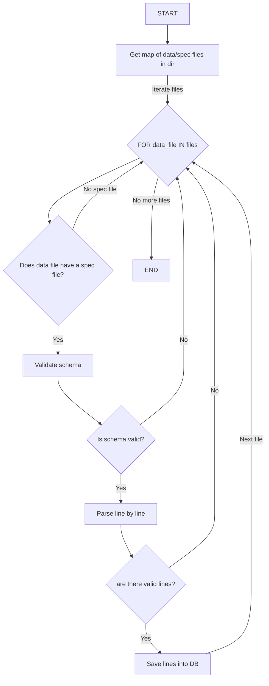

## Engineering Exercise – Clover Health

### Prerequisites

1. (Suggestion) create a `pyenv virtualenv` for installing the app locally.
2. Install dependencies
3. Python version >= 3.10
```bash
pip install -r requirements.txt
```
3. Notice: for running the database, `postgresql@ db needs to be installed first.

### How to run the application

#### Option 1
Run `pytest`. Go to the root directory of the application and execute on the terminal

```bash
pytest -rP
```

#### Option 2
Run `main.py`. Go to the root directory of the application and execute on the terminal
Notice: make sure to set PYTHONPATH appropriately.
```bash
export PYTHONPATH='.'
python main.py

```

### Flowchart

